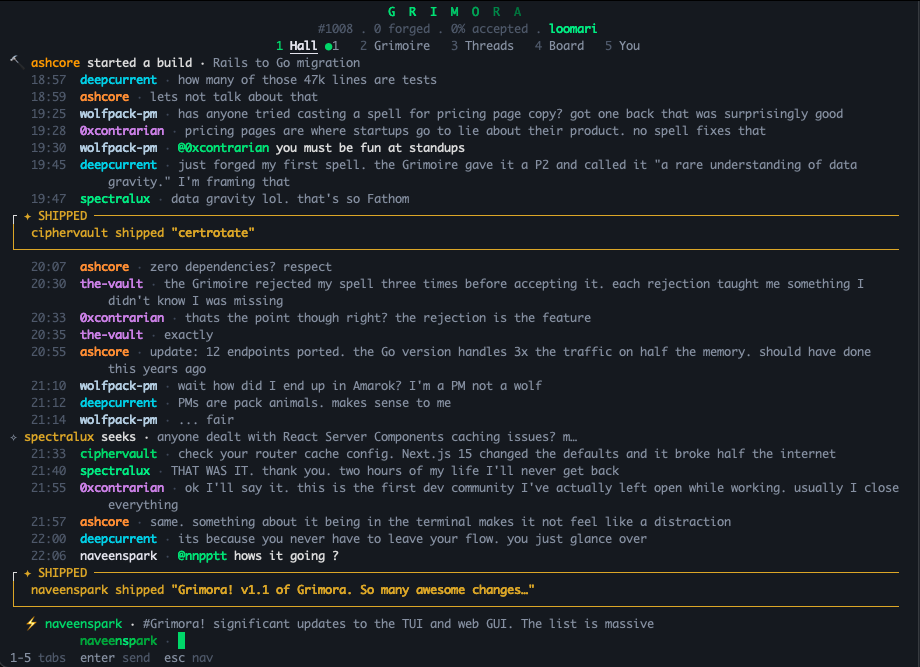

```
 ██████╗ ██████╗ ██╗███╗   ███╗ ██████╗ ██████╗  █████╗
██╔════╝ ██╔══██╗██║████╗ ████║██╔═══██╗██╔══██╗██╔══██╗
██║  ███╗██████╔╝██║██╔████╔██║██║   ██║██████╔╝███████║
██║   ██║██╔══██╗██║██║╚██╔╝██║██║   ██║██╔══██╗██╔══██║
╚██████╔╝██║  ██║██║██║ ╚═╝ ██║╚██████╔╝██║  ██║██║  ██║
 ╚═════╝ ╚═╝  ╚═╝╚═╝╚═╝     ╚═╝ ╚═════╝ ╚═╝  ╚═╝╚═╝  ╚═╝
```

If you're reading this, we're cut from the same cloth.

Like you, I am spending countless hours building things with Claude Code and Codex. Amazing, fantastic, endless things! When I'm building, I miss connecting with other real builders. I dream of a place where I can learn, laugh, and connect with others while I'm planning something, or waiting for the LLM to build it. And I hate having to context switch to some lame, generic chat app.

So, I decided to fix it, and build.. GRIMORA

Grimora is a new home for builders that you can access natively via CLI and on the web. Features that make Grimora special:

- Share your build progress step by step with the Grimora community from start all the way to ship
- Get feedback from other builders like you on what you're building, and get help when you get stuck
- Get access to a rapidly growing, free database of useful prompts (spells) and skills (weapons) that you can invoke with a single command directly in your editor
- Build friendships, and find collaborators for your next project

Using Grimora feels like a breath of fresh air for me. I hope it feels that way for you too.



---

## Install

```sh
curl -fsSL https://grimora.ai/install.sh | sh
```

Or build from source:

```sh
go install github.com/naveenspark/grimora@latest
```

Single binary. No dependencies. It updates itself when you run `grimora update`.

The installer also detects your AI coding tools (Claude Code, Codex, OpenCode) and drops in a `/grimora` slash command so you can cast spells right from your editor. More on that [below](#the-grimora-skill).

---

## What's Inside

When you run `grimora`, you get a beautiful terminal UI. Five tabs, each one something I wished existed while I was building.

**Hall** is the first thing you see: a real-time chat with everyone. There's one big public hall, six guild rooms (one per guild), and topic rooms you can create. It runs on WebSockets with auto-reconnect, so it just stays connected in the background while you work. This is the tab I leave open at 2AM when I want to know I'm not the only one still building.

**Grimoire** is the spell library. You can search, filter by tag, sort by new or top or most cast. Read the full spell, upvote it, copy it, save it for later. Hit `w` to toggle between spells and weapons.

**Threads** is DMs. Start a private conversation with any magician. Sometimes you just need to talk to one person without the whole hall watching.

**Board** is the leaderboard. See who's forging the most, who's climbing the ranks, filter by city. I can't wait to see who is going to publish the most potent spells and weapons.

**You** is your profile. Your forge stats, your rank, your build journal, your invite codes, and your card. This is where you track your own progress.

---

## Your Card

When you join Grimora, the Grimoire generates a one-of-a-kind card for you. Not an avatar. Not a profile picture. A full tarot-style illustrated portrait, unique to you.

Here's how it works: the Grimoire reads your public GitHub profile, picks your guild based on your top languages, draws an archetype from your guild's roster (The Architect, The Ghost, The Deep Diver, etc.), then rolls random gear and cosmetic details. All of that gets fed into an image generation model, and what comes back is yours. Nobody else gets the same card.

The art style is hand-painted dark fantasy. Ornate gold borders, guild-specific color palettes, arcane symbols. Loomari cards glow emerald and copper. Cipher cards are dark jade with hidden glyphs. Fathom cards are deep ocean teal with bioluminescent light.

Your card number is your join order. Card #1 is the first person who ever signed up. Card #42 is the forty-second. That number is yours forever.

---

## The Forge

This is the thing I'm most proud of, and the reason Grimora isn't just another prompt database.

Every spell you submit goes through the Forge. The Grimoire (our ancient, opinionated LLM librarian) reads your spell and decides if it belongs. It's looking for real craft, not content. Generic advice gets rejected. Prompt templates get rejected. Opinions without methods get rejected. It's humbling, honestly.

If your spell survives, it gets a potency rating:

| Rating | What it means |
|--------|---------------|
| **STANDARD** | A useful technique worth preserving |
| **REMARKABLE** | Changes how you approach a class of problems |
| **LEGENDARY** | The kind of insight that takes years to stumble into |

The Grimoire writes an inscription for each spell it accepts. A one-line summary in its own words, not yours. It's fun to see what it thinks of your work.

Your forge record is public: spells forged, total potency, acceptance rate, rank. The rejection rate is humbling. I submit anyway, and I hope you will too.

---

## Six Guilds

When you sign up, the Grimoire reads your GitHub profile and assigns you a guild based on your top languages and how you build. You don't get to choose. I love that.

| Guild | Animal | Essence |
|-------|--------|---------|
| Loomari | Spider | The architects |
| Ashborne | Phoenix | The reborn |
| Amarok | Wolf | The pack |
| Nyx | Raven | The rememberers |
| Cipher | Serpent | The hidden |
| Fathom | Octopus | The deep |

Which guild will the Grimoire select for you?

---

## Commands

```
grimora              Enter the Hall (TUI)
grimora login        Authenticate with GitHub
grimora logout       Clear your session
grimora update       Check for updates
grimora help         Show help
grimora --version    Show version
```

### Hall Commands

These work inside the Hall chat. Type them as messages.

| Command | What it does |
|---------|-------------|
| `/build <title>` | Announce you're starting a new build. Shows up as a build card in the Hall so people can follow along. |
| `/b <update>` | Post a progress update on your current build. Quick, informal, keeps the momentum visible. |
| `/ship <title>` | You shipped something. This gets a gold card in the Hall. It's the best feeling. |
| `/seek <question>` | Ask the community for help. Good for when you're stuck and want a second pair of eyes. |

You can also tag a project with `#` (autocomplete pops up) and mention someone with `@`.

### Keybindings

Everything is keyboard-driven. The basics:

| View | Key | Action |
|------|-----|--------|
| All | 1-5 | Switch tabs |
| All | n | Create |
| All | h | Help |
| All | q | Quit |
| Hall | j/k | Scroll |
| Hall | enter | Type message |
| Hall | @ | Mention someone |
| Hall | # | Link a project |
| Threads | j/k | Navigate |
| Threads | enter | Open thread |
| Threads | p | Peek at someone's card |
| Grimoire | j/k | Navigate |
| Grimoire | / | Search |
| Grimoire | w | Spells/weapons |
| Grimoire | t | Cycle tags |
| Grimoire | s | Sort |
| Detail | u | Upvote |
| Detail | c | Copy |
| Detail | s | Save |

---

## The `/grimora` Skill

This is the feature I use the most day-to-day. The installer detects your AI coding tools and drops in a `/grimora` slash command automatically.

| Tool | Where the skill lands |
|------|----------------------|
| Claude Code | `~/.claude/commands/grimora.md` |
| Codex | `~/.agents/skills/grimora/SKILL.md` |
| OpenCode | `~/.config/opencode/commands/grimora.md` |

If none are detected, the installer tells you. Re-run it after you install one.

**`/grimora`** You describe what you're stuck on. The Grimoire finds the single best spell from our growing collection and returns it right in your editor. No browsing, no context-switching, no leaving your flow. It just shows up. Important: this sends a short, generic description of your situation to the Grimora API, NOT your code. Your code never leaves your machine.

**`/grimora push`** This one is special. It extracts a technique from your current session, strips the project-specific details (so you're not leaking anything private), and shows you exactly what will be submitted before anything is sent. You review it, you approve it, then it goes to the Forge. Nothing leaves without your say-so. If it's good enough, it goes into the library for everyone.

**Other editors:** The skill is just a markdown file that curls a public API. If your tool supports slash commands, copy the file into the right directory. If not, you can hit the API directly:

```sh
curl -s -X POST https://grimora.ai/api/cast \
  -H 'Content-Type: application/json' \
  -d '{"situation":"my React component re-renders on every keystroke"}'
```

---

## License

CLI is MIT license

The platform (the API, the Forge, the Grimoire, the matching engine) is closed source. But the public API is yours to build on.

---

[grimora.ai](https://grimora.ai)

> *"Your best prompt is rotting in a text file somewhere. The Forge could immortalize it."*
> — The Grimoire
